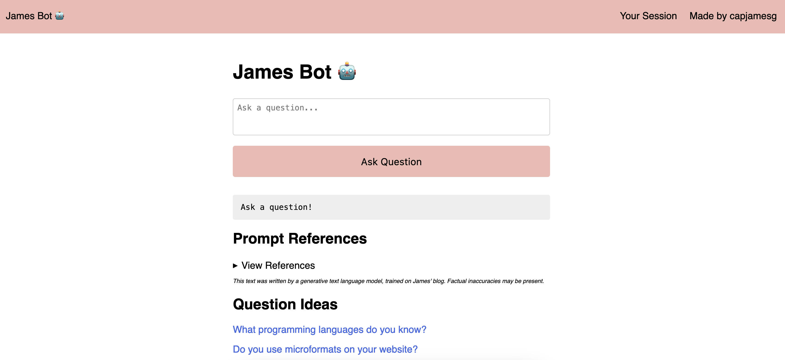

# AI Documentation Chatbot (Powered by ChatGPT 3.5)

The source code for James Bot, a bot that makes reference to a corpus of documents to answer questions.



## How it Works

This AI documentation bot has three components:

1. Data ingestion, where a reference index and vector store are compiled. At this stage, the program calculates the embeddings associated with the text documents you want to ingest. You may want to write custom ingestion scripts that work with your data. An example is provided in the `example_ingest.py` file. The reference index maps to the ID associated with each item in a vector store, both of which are queried in the web application.
2. Prompt generation, where you create a prompt configuration for use in the application.
3. The web application, where:
   1. A user enters a query;
   2. The vector index and reference index are queried to return information about the entry;
   3. A prompt is generated to send to ChatGPT and;
   4. The response from the OpenAI API is returned to the client.
   
### Disclaimer
   
This application sends data from the sources you provide to OpenAI in a prompt for use in answering questions. You should independently research the data policies of OpenAI to understand how your data may be used.

## Getting Started

### Install Dependencies

To get started with this project, first set up a virtual environment and install the required dependencies:

```
python3 -m venv venv
source venv/bin/activate
pip3 install -r requirements.txt
```

### Configure Database

Next, we need to set up a PostgreSQL database. The required database schema is stored in the `schema.sql` file. Run this command to create the database from the schema:

```
psql -f schema.sql
```

Now, open the `config.py` file and set the database connection details:

```
DB_HOST="localhost"
DB_NAME="name"
DB_USER="user"
DB_PASS="password"
```

### Configure OpenAI API Access

You will need an OpenAI API key to use this project. Create an OpenAI account, then retrieve your API key. Save the key into your `config.py` file:

```
OPENAI_KEY=""
```

### Configure IndieAuth Authentication

This application uses IndieAuth to support the administration panel. To authenticate as an admin, you must set up IndieAuth on your website.

When you have set up IndieAuth, you can set the following variables in the `config.py` file:

```
CALLBACK_URL="https://example.com/callback"
CLIENT_ID="https://example.com"
ME="https://yoursite.com" # the URL of your personal website with which you will authenticate.
```

### Ingest Content

Next, create a folder called `pending_indexing`. In that folder, store any JSON documents that you want to ingest into the reference index. The JSON documents should contain, at minimum a `text` field with the text of the document. The JSON documents may be blog posts, podcast transcripts, chat logs, or any other type of text document.

Next, you will need to ingest content to create a reference index and data store based on the JSON documents you have stored in the `pending_indexing` folder.

To create the index, run this command:

```
python3 ingest.py
```

This will create a reference index and vector store in the `indices/` directory. The reference index is a JSON file that maps the ID of each item in the vector store to the text of the document. The vector store is a binary file that contains the embeddings for each item in the index.

### Set Up a Prompt

Next, you need to configure a prompt. This is the template that will be used to create a prompt that is sent to the OpenAI API.

To do so, open the `generate_prompt.py` file and replace the example text with the prompt that you want to use in the web application. By using this file, you can generate different versions of a prompt for use in your application. This makes it easy for you to track changes to your prompts over time and revert back to previous versions if required.

An example prompt is:

```
You are James. Answer using "I". Answer the question '[[[QUERY]]]?'.

If you use text in a section to make a statement, you must cite the source in a HTML <a> tag. The text in the Sources section is formatted with a URL and a passage. You can only cite sources that are in the Sources section. The anchor text must be the title of source. You must never generate the anchor text.

Use the Sources text below, as well as your facts above, to answer. Sources have dates at the end. You should prefer more recent information. And add a caveat such as "this may be out of date since my Source was published on [date]", where [date] is the date on which the source was published. if you are citing information older than one year from [[[CURRENT_DATE]]]

[STOP] means end of sources.\n

Sources
-------

[[[SOURCES]]]

[STOP]
```

In this prompt, values in `[[[]]]` are substitutions. These substitutions are replaced with values from the JSON documents at query time.

By default:

- `[[[QUERY]]]` is replaced with the text a user submits as a query in the web interface.
- `[[[SOURCE]]]` is replaced with the text of the document that is returned from the vector store.
- `[[[CURRENT_DATE]]]` is replaced with the current date.

To configure other substitutions, modify the logic in the `web.py` file where the `prompt_data.execute()` call is made.

You should specify a `System` prompt that contains high-level rules in the `generateprompt.py` file. Then, add an `Assistant` prompt. The `Assistant` prompt should contain specific instructions for the assistant to follow, and is where the user query and sources information will be added.

You can then generate a prompt version using this line of code:

```
python3 generateprompt.py
```

### Run the Web Application

Next, you can run the web application:

```
python3 web.py
```

The chatbot will be available at `http://localhost:5000`.

## Schemas and Indices

The `ingest.py` script stores indices in the `indices/` directory. For each new index, a new directory is created with the number corresponding with the index.

The most recent index is stored in `indices/current.json`.

Each numbered folder will contain two types of files:

1. A JSON file with the structured information you have ingested.
2. The vector store, which contains the embeddings for each item in the index. This is stored in a `.bin` file.

If you have created multiple indices for a single version, they will all appear in the numbered folder associated with that version.

## Application Routes

The web application has a few user-facing routes:

- `/`: Send a query to the API.
- `/adminpage`: View all prompts added to the system.
- `/login`: Authenticate with [IndieAuth](https://indieweb.org/IndieAuth).
- `/session`: See all the prompts that you have created, stored in `localStorage`.
- `/logout`: Log out of the application.
- `/prompt/<id>`: View a specific prompt.

## API

### Send a Query

You can send a query to the API to retrieve a response in a JSON format. To do so, use the following query structure:

```
curl -X POST -d "query=What books do you like?" http://localhost:5000/query
```

This query returns a payload in this form:

```
{
   "id": "prompt",
   "knn": [
      "Books!!!","## Reading Books",
      "I do not read books very often but I do enjoy reading. While I have read more books on coffee than anything else, I am very fond of fiction, particularly Japanese fiction. I like getting to know the characters and seeing them change throughout a book.",
      ...
   ],
   "references": {
      "inline":[],
      "sources":[
         {"title":"https://chat.indieweb.org/{\"type\":\"m","url":"https://chat.indieweb.org/{\"type\":\"m"},
         {"title":"How I Learn About Speciality Coffee","url":"https://jamesg.blog/2020/10/25-how-i-learn-about-speciality-coffee/"},
         ...
      ]
   },
   "response": "Answer: I do not read books very often but I do enjoy reading. While I have read more books on coffee than anything else, I am very fond of fiction, particularly Japanese fiction.\n\nEvaluation: This is my answer based on my personal preference when it comes to books.\n\nTruth: N/A Since this is a personal preference and not a factual statement, it cannot be evaluated as true or false based on the sources provided."
}
```

Where:

- `id`: The unique ID associated with the answer.
- `knn`: The nearest neighbours of the query in the vector store, used as Sources (if configured).
- `references`: The references associated with the answer.
- `response`: The response from the OpenAI API.

### Save Document for Indexing

Indexing happens in two stages: 

1. Save a document via the API or a custom ingestion script, then;
2. Run the `ingest.py` script to create the vector store.

To save a document for later indexing, make the following request:

```
// should be a json request

curl -X POST -d '{"title":"My Title","content":"My Content","date":"2023-01-01","url":"https://example.com"}' http://localhost:5000/index
```

A 200 response indicates that the document was successfully saved.

The JSON payload can be any arbitrary JSON, but there MUST be a value called `text` present. `text` must contain the main content in the document. This is the content for which an embedding will be calculated.

The following keys are recommended, in addition to `text`:

- `title`: The title of the document.
- `date`: The date on which the content was published.
- `url`: The URL where content can be found.

Whenever you want to update the index, run the `ingest.py` script. Then, restart the web application. This restart is necessary because the vector database is held in RAM in the web application.

## Contributors

- capjamesg

## License

This project is licensed under an [MIT 0 (No-Attribution) License](LICENSE).